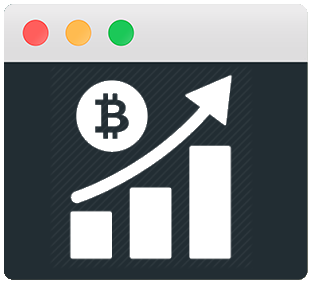

<p align="center">
    <h1 align="center">bitcoin-chart-cli<br></h1>
</p>

<p align=center>
<a href="https://npmjs.com/package/bitcoin-chart-cli"></a>
<a href="https://opensource.org/licenses/MIT"></a>
<a href="https://travis-ci.org/madnight/bitcoin-chart-cli"></a>
<a href="https://codeclimate.com/github/madnight/bitcoin-chart-cli/issues"></a>
<a href="https://snyk.io/test/github/madnight/bitcoin-chart-cli"></a>
<a href="https://david-dm.org/madnight/bitcoin-chart-cli"></a>
 <br> <br>



Bitcoin chart for the terminal as command line util.<br>
For a list of supported cryptocurrencies see <a href="COINS.md">coins</a>.

### Requirements
 * node 8.0 or higher
 * npm or yarn

### Usage

```bash
# install
npm install bitcoin-chart-cli -g

# (alternative) install with yarn
yarn global add bitcoin-chart-cli

# run default
bitcoin-chart-cli

# run with options
bitcoin-chart-cli --coin ETH -d 360 -w 80 -h 20
```

### Options
```bash
bitcoin-chart-cli --help


  Usage: index [options]


  Options:

    -V, --version           output the version number
    -d, --days <n>          number of days the chart will go back
    --hours <n>             number of hours the chart will go back
    --mins <n>              number of minutes the chart will go back
    -w, --width <n>         max terminal chart width
    -h, --height <n>        max terminal chart height
    -c, --coin <string>     specify the coin e.g. ETH
    -m, --currency <string> specify the trading pair currency (Default: USD)
    --disable-legend        disable legend text
    -h, --help              output usage information
```
# Examples


```bash
bitcoin-chart-cli
```


```
Create terminal splits (tmux) with watch for live charts the unix way
watch -n 60 bitcoin-chart-cli --mins 30 --width 60
```


```bash
In combination with conky
conky.text = [[ ${execi 120 bitcoin-chart-cli --coin ETH -w 140 -h 15} ]];
```
More examples https://travis-ci.org/madnight/bitcoin-chart-cli

## Experimental Bitcoin Live Price Feature

```bash
bitcoin-chart-cli --live
```
Prints a chart based on bitfinex live price values. The price is updated on every bitfinex trade, up to multiple times per second. This is as live as it can be. Most platforms provide 1 min candles as minimum timeframe. This feature allows you to see intra minute price changes within seconds and milliseconds. Please note that this feature does not work together with conky, since it requires a permanent connection and does not exit (like ncurses applications).
